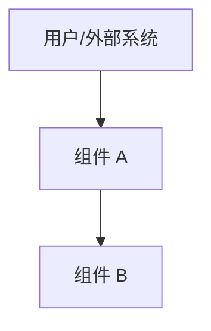

# {{project_name}} 架构总览

## 1. 项目背景与目标

- 背景：
- 业务目标：
- 成功标准：

## 2. 组件清单

| 组件 | 类型 | 职责 | 编程语言 | 技术栈 |
|------|------|------|----------|--------|

## 3. 技术栈总览

| 技术域 | 选型 | 说明 |
|--------|------|------|

## 4. 架构全景图

## 5. 文档索引

- [需求分析](./requirement-analysis.md)
- [物理架构](./physical-architecture.md)
- [逻辑架构](./logical-architecture.md)
- [核心能力模型](./capability-model.md)
- [领域模型](./domain-model.md)
- [ADR](./adr/)

## 6. 关键决策摘要

- 决策 1：
- 决策 2：
