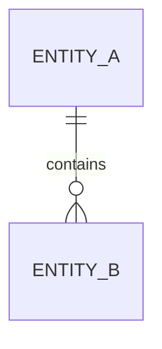

# {{project_name}} 数据模型

## 1. 建模范围

- 核心业务对象：
- 非核心对象：
- 不纳入本次建模的对象：

## 2. 核心实体

| 实体 | 说明 | 主键/唯一键 | 所属边界 | 状态字段 | 一致性要求 |
|------|------|-------------|----------|----------|------------|

## 3. 实体关系

## 4. 状态与生命周期

| 实体 | 状态 | 进入条件 | 退出条件 |
|------|------|----------|----------|

## 5. 数据边界与归属

- 哪些数据归属哪个组件：
- 哪些数据允许冗余：
- 哪些数据必须强一致：

## 6. 数据风险与演进

- 当前最脆弱的数据点：
- 扩展时最可能变化的结构：
