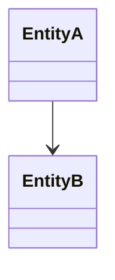
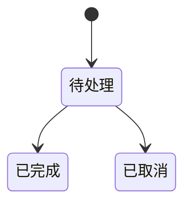

# {{project_name}} 领域模型

## 1. 领域划分

## 2. 核心实体

| 实体 | 描述 | 聚合 | 关键属性 | 关键规则 |
|------|------|------|----------|----------|

## 3. 聚合与边界

## 4. 实体关系

```mermaid
classDiagram
    class EntityA
    class EntityB
    EntityA --> EntityB
```

## 5. 关键状态流转

```mermaid
stateDiagram-v2
    [*] --> 待处理
    待处理 --> 已完成
    待处理 --> 已取消
```

## 6. 模型边界决策
