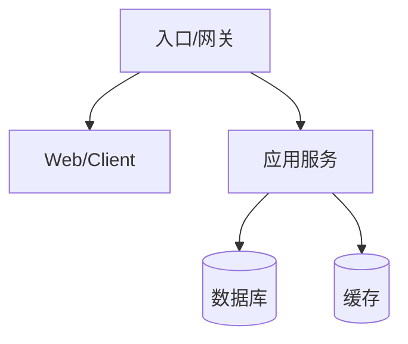

# {{project_name}} 物理架构

## 1. 部署视图

```mermaid
graph TD
    LB[入口/网关] --> WEB[Web/Client]
    LB --> APP[应用服务]
    APP --> DB[(数据库)]
    APP --> CACHE[(缓存)]
```

## 2. 运行环境

## 3. 网络与访问边界

## 4. 中间件与基础设施

| 类型 | 组件 | 用途 | 备注 |
|------|------|------|------|

## 5. 数据存储布局

## 6. 外部系统依赖

## 7. 部署与基础设施决策
