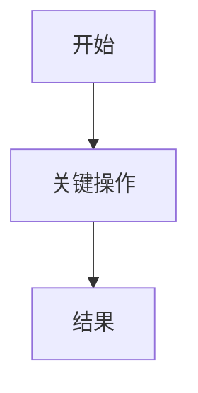
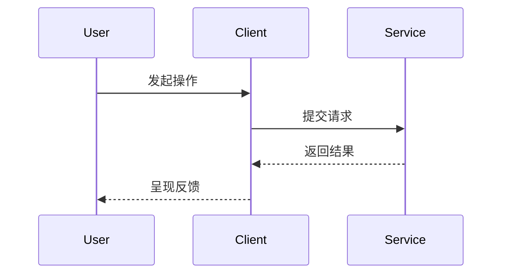

# {{project_name}} 需求分析

> 本文件是 Phase 1 产物，作为下游所有 ADR / API / 契约 / 骨架文档的**编号源头**。
> 所有场景 / 功能需求 / 成功标准必须编号（US-xxx / FR-xxx / SC-xxx），供下游回链。

## 1. 业务背景

## 2. 目标用户与角色

| 角色 ID | 角色名 | 核心诉求 | 使用频率 |
|---------|--------|----------|----------|
| R-001 |  |  |  |

## 3. 核心业务目标

| 目标 ID | 描述 | 成功的样子（可观测） |
|---------|------|----------------------|
| G-001 |  |  |

## 4. 核心场景（User Stories）

> 每条场景必须有唯一 `US-xxx` 编号，描述格式建议 "作为 X，我想 Y，以便 Z"。
> 编号一旦对外公布（进入 ADR / API / 骨架），禁止重用或废弃回收。

### US-001 {{标题}}

- **角色**：R-xxx
- **描述**：
- **触发条件**：
- **主流程**：
- **Given/When/Then 验收场景**（≥ 1 条）：
  - Given ...
  - When ...
  - Then ...
- **优先级**：P0 / P1 / P2
- **关联功能需求**：FR-xxx, FR-yyy
- **成功标准（量化）**：SC-xxx

### US-002 ...

## 5. 功能需求（Functional Requirements）

> 每条必须编号；描述 "系统应/必须做什么"，技术无关。

| FR ID | 描述 | 来源 US | 影响模块（Phase 5 回填） |
|-------|------|---------|----------------------|
| FR-001 |  |  |  |
| FR-002 |  |  |  |

## 6. 成功标准（Success Criteria）

> 每条必须量化、技术无关、可验证。用于后续做验收和压测目标。

| SC ID | 描述 | 度量方式 | 目标值 | 来源 US / FR |
|-------|------|----------|--------|---------------|
| SC-001 |  |  |  |  |

## 7. 硬约束（Constraints）

> 分类：法规 / 合规 / 性能 / 安全 / 成本 / 团队。每条必须是"不能突破"的硬线。

| C ID | 约束 | 类型 | 来源 |
|------|------|------|------|
| C-001 |  |  |  |

## 8. 关键交互流程

## 9. 关键时序图

## 10. 假设与待确认项

| # | 假设 | 若不成立的影响 | 确认责任人 |
|---|------|----------------|------------|

## 11. 本期明确不做（Out of Scope）

- 不做项 1：
- 不做项 2：

---

> **判定是不是好编号的两个问题**：
> 1. 给定一个 FR-003，能不能在 API 设计里找到至少一条服务它的接口？
> 2. 给定一个 ADR-005，能不能在本文件里找到它背后想满足的 FR / SC？
> 如果任一问题答不出，说明编号系统没形成闭环。
